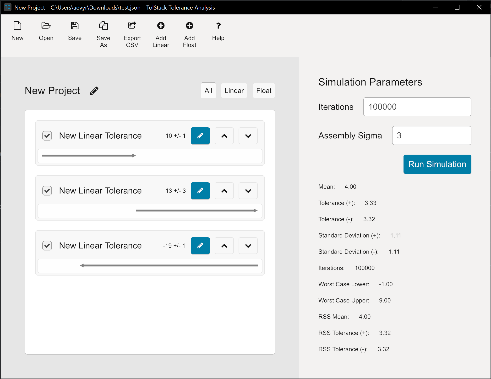

# TolStack

Simple 1D Monte-Carlo simulation of tolerance chains. **Unstable, GUI implementation in progress.**

## Features

Mechanical Interfaces

* `Linear`: Linear dimensions (point A to B)
* `Float`: Single hole/pin pair (a part with one pin located in another part with one hole)
* `Compound`: Double hole/pin pairs in parallel (a part with two pins located in another part with two holes)

Tolerances

* Unilateral tolerances (+0/-0.5)
* Equal bilateral tolerances (+/-0.5)
* Unequal bilateral tolerances (+0.2/-0.1)

Input/Output

* Saving/loading JSON files
* Exports simulation output data to CSV for plotting

## Todo

* Test coverage
* GUI for building tolerance model as well as saving/loading.
* Generalize the Compound tolerance interface to allow for more than two pairs of connected holes and pins
* Add RSS tolerance analysis
* Add worst case tolerance calculation
* Generate plots in GUI
* Make threading more intelligent, detect num_cpus
* Revisit optimization
* Go 2D?
